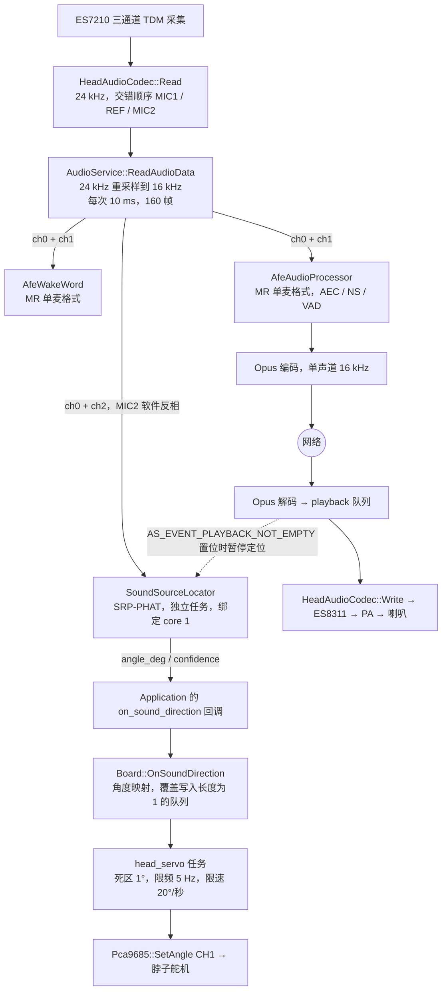

# audio-test

基于小智 AI ESP32 `v2.2.6`（提交 `49ac8a6da399f27a9546d4f73640b7f86c24bac6`）
定制的「智慧头」固件。在保留上游实时语音聊天能力的基础上，新增了三通道
音频采集、设备端 AEC、双麦克风声源定位，以及由定位结果驱动的脖子舵机转向。

本节梳理 `head` 板的硬件配置、整体架构、音频与舵机的实现思路和开发细节，
并给出可照着复刻的改造步骤、踩坑清单和验证清单。分隔线以下为上游项目原始
文档，未作改动。

## 目录

- [开发环境与基线](#开发环境与基线)
- [硬件配置](#硬件配置)
- [整体架构与数据流](#整体架构与数据流)
- [音频链路实现](#音频链路实现)
- [声源定位实现](#声源定位实现)
- [舵机驱动与跟随实现](#舵机驱动与跟随实现)
- [可调参数速查](#可调参数速查)
- [构建与配置](#构建与配置)
- [从上游基线复刻](#从上游基线复刻)
- [对上游公共代码的改动](#对上游公共代码的改动)
- [踩坑清单](#踩坑清单)
- [验证清单](#验证清单)
- [已知限制](#已知限制)

## 开发环境与基线

| 项 | 版本 / 取值 |
| --- | --- |
| ESP-IDF | v5.5.3 |
| 目标芯片 | `esp32s3` |
| 上游基线 | 小智 AI ESP32 `v2.2.6`，提交 `49ac8a6da399f27a9546d4f73640b7f86c24bac6` |
| 板型标识 / 构建名 | `head` |
| 关键组件 | `espressif/esp-sr ~2.3.0`、`espressif/esp_codec_dev ~1.5.11` |

`esp_codec_dev` 的版本下限是硬性要求，原因见下文「全双工 I2S」一节。

## 硬件配置

主控为 ESP32-S3 N16R8（16 MB Flash + 8 MB Octal PSRAM），无显示屏、无 LED、
无按键。板级代码位于 [`main/boards/head/`](main/boards/head/)，引脚定义集中在
[`config.h`](main/boards/head/config.h)。

### 音频

| 功能 | 引脚 / 参数 |
| --- | --- |
| I2S MCLK / BCLK / WS | GPIO21 / GPIO41 / GPIO39 |
| I2S DOUT（送 ES8311） | GPIO40 |
| I2S DIN（收 ES7210） | GPIO38 |
| 功放使能 PA | GPIO42 |
| Codec I²C（`I2C_NUM_1`） | SDA GPIO13、SCL GPIO14 |
| ES8311 / ES7210 地址 | 各自默认地址 |
| 采样率 | 输入、输出均为 24 kHz |

ES7210 是 4 通道 ADC，本项目只使能其中三路：

| 通道 | 用途 |
| --- | --- |
| MIC1 | 左耳麦克风，收音孔朝正前方 |
| MIC2 | 右耳麦克风，与 MIC1 同一水平轴，间距 45 mm |
| MIC3 | 接 ES8311 OUTP/OUTN，作为设备端 AEC 的扬声器回采参考 |
| MIC4 | 未使用，不进入采集数据流 |

### 舵机

| 功能 | 引脚 / 参数 |
| --- | --- |
| 舵机 I²C（`I2C_NUM_0`） | SDA GPIO8、SCL GPIO7 |
| PCA9685 地址 | `0x40` |
| PWM 频率 | 50 Hz |
| 舵机通道 | CH1（第二路输出，索引 1） |
| 电源使能 | GPIO0，低电平有效 |

GPIO0 同时是 ESP32-S3 的启动绑带（strapping）引脚，硬件必须保证复位采样
期间保持高电平，否则设备会进入下载模式。GPIO0 被占用后，Head 板取消了原
Boot 按键的全部交互功能。

音频和舵机刻意使用两条独立的 I²C 总线：舵机的周期性写入不会与 Codec 寄存器
访问互相阻塞，PCA9685 掉电也不会影响音频初始化。

## 整体架构与数据流



三条消费链路共享同一份重采样后的三通道数据，互不修改、互不阻塞。定位只是
「旁路读取」：它从不改动送往 AFE 的音频，因此启用或关闭定位都不会影响实时
对话和 AEC 的行为。

### 关键前提：TDM 实际输出顺序是 `MRM`

ES7210 输出的交错顺序并不是「MIC1、MIC2、MIC3」，实测为：

```text
索引 0 = MIC1（左）    索引 1 = MIC3（AEC 参考）    索引 2 = MIC2（右）
```

这个 `M R M` 顺序是后续所有通道提取逻辑的基准，任何一处取错都会导致
AEC 拿到麦克风信号、或定位拿到扬声器回采。**复刻时请先用实际硬件确认这个
顺序**，它取决于 ES7210 的接线和驱动版本，不要直接照抄。

### 三个通道分别服务谁

三通道不是给同一个算法用的，而是两个需求完全不同的算法各取所需，**唯一的交集
是 MIC1**：

| 通道 | 索引 | 实时对话 / 唤醒 | 声源定位 |
| --- | --- | --- | --- |
| MIC1（左） | 0 | 唯一的人声输入，即格式里的 `M` | 左路输入 |
| MIC3（回采参考） | 1 | AEC 参考，即格式里的 `R` | 不使用 |
| MIC2（右） | 2 | 不使用 | 右路输入（软件反相后） |

之所以能这样拆，是因为两个算法要解决的问题本来就不一样：

- **AEC 要的是「1 只麦克风 + 1 路回采」**。它把 MIC3 上的扬声器信号当作已知量，
  从 MIC1 里减掉，得到干净人声。它不需要第二只麦克风。
- **DOA 要的是「2 只有间距的麦克风」**。它比较同一个声音到达 MIC1 和 MIC2 的
  时间差来反推方向。它不需要回采参考。

所以对话链路读索引 `0 + 1`，定位链路读索引 `0 + 2`，两条链路各自从同一份三通道
数据里挑走自己需要的那两路，互不修改也互不阻塞。

需要注意二者的形式并不对称：`MR` 是真实传给 `afe_config_init()` 的 AFE 输入格式
字符串，而定位侧**没有**对应的 `MM` 格式——`esp_doa_process()` 直接接收两个独立
的单声道缓冲区，既不经过 AFE，也没有格式字符串。代码里搜不到 `"MM"`。

### 任务模型：一个生产者，多个常驻消费者

所有任务都在**开机时创建一次并常驻**，不存在「收到声音才创建任务」的行为——
音频每 10 ms 就来一帧，按帧创建任务会立刻拖垮系统。声音到来时发生的只是把
数据塞进已经在跑的任务的队列。

只有 `audio_input` 一个任务在读 codec，读完在同一个任务里顺序调用三个
`Feed()`。这三个 `Feed()` 都**不做 DSP**，只做「挑通道 + 拷贝 + 入队」，因此
不会拖慢 10 ms 的采集节奏：

- 定位的 `Feed()`：取 ch0/ch2、反相、`xQueueSend` 到自己的队列。
- 两个 AFE 的 `Feed()`：重排成 `MR`，攒够一个 chunk 后调 `afe_iface_->feed()`
  写入 AFE 的内部环形缓冲区。

真正的计算发生在各自的常驻任务里：

| 任务名 | 创建位置 | 优先级 | 栈 | 绑核 | 职责 |
| --- | --- | --- | --- | --- | --- |
| `audio_input` | `AudioService::Start()` | 8 | 6144 | core 0 | 读 codec，扇出给三个消费者 |
| `sound_locator` | `SoundSourceLocator` 构造函数 | 2 | 6144 | core 1 | 攒满 1024 点后跑 SRP-PHAT |
| `audio_communication` | `AfeAudioProcessor::Initialize()` | 3 | 4096 | 不绑 | `fetch()` 取 AEC / NS 后的人声 |
| `audio_detection` | `AfeWakeWord::Initialize()` | 3 | 4096 | 不绑 | `fetch()` 做唤醒词判定 |
| `opus_codec` | `AudioService::Start()` | 2 | 24576 | 不绑 | Opus 编解码 |
| `audio_output` | `AudioService::Start()` | 4 | 4096 | 不绑 | 写 codec 播放 |
| `head_servo` | `HeadBoard::StartServoTracking()` | 2 | 3072 | 不绑 | 舵机限速跟随 |

需要注意创建时机并不统一：`sound_locator` 在 `AudioService::Initialize()` 里
立即创建，而 `audio_communication` 和 `audio_detection` 是**懒创建**——分别要等
第一次 `EnableVoiceProcessing(true)` / `EnableDeviceAec()` 和
`EnableWakeWordDetection(true)` 才会建立（由 `audio_processor_initialized_`
和 `wake_word_initialized_` 兜底）。因此设备尚未进入对话状态时，定位任务就已经
在运行了。

另外，定位是「一个任务干完全部」，而对话是一条多级流水线：`audio_input` →
`audio_communication` → `opus_codec` → `audio_output`。两条链路上真正对等的
是 `sound_locator` 和 `audio_communication`——它们都从 `audio_input` 拿同一份
数据，都是各自链路里做重活的那一级。

AFE 内部还有自己的工作线程：`fetch()` 是阻塞接口（默认超时 2000 ms），说明
处理并非在 `feed()` 里同步完成，我们的任务只负责取结果。

两条链路的节奏也不同：`audio_input` 每 10 ms 转一圈，AFE 按自己的 chunk 大小
出结果；定位需要攒满 1024 点（约 6.4 次 `Feed`，64 ms）才算一次角度，更新率
上限约 15.6 次/秒。定位本身就比对话链路慢得多，这也是舵机把输出限到 5 Hz
仍不会丢失有效信息的原因。

## 音频链路实现

### 板级专用 Codec

新增 [`HeadAudioCodec`](main/boards/head/head_audio_codec.cc) 而不是复用公共的
`BoxAudioCodec`，目的是把「三通道 + MIC3 做参考」这一非常规配置限制在板级，
不改变其他开发板对通道数的默认假设。

Codec 向上层声明 `input_channels_ = 3`、`input_reference_ = true`、
`input_gain_ = 30`（dB）。

### 全双工 I2S：TX 走 STD，RX 走 TDM

发送和接收共用 `I2S_NUM_0` 以及同一组 MCLK/BCLK/WS，但配置方式不同：

- TX：标准 I2S 立体声，单声道 PCM 送 ES8311。
- RX：TDM 模式，`total_slot = 4`，`slot_mask = SLOT0 | SLOT1 | SLOT2`，
  只取 ES7210 的前三个时隙。

`esp_codec_dev` 依赖版本从 `~1.5.6` 提升到 `~1.5.11`，因为旧版本在全双工场景下
会把 RX 的通道掩码错误地套用到 STD TX 上，导致输出异常。

打开输入设备时按 `channel = 4`、`channel_mask = 0b111` 描述采样格式，并只对
掩码 0 和 1（对应 ES7210 的 MIC1 和 MIC2）施加 30 dB 增益，让 MIC3 参考通道
保持原始电平——放大回采参考只会让 AEC 更难收敛。

### 通道提取：为什么最终选择单麦 `MR`

ESP-SR 的 `AFE_TYPE_VC`（语音通信类型）只支持一路麦克风输入，因此唤醒和对话
都统一使用 `"MR"` 格式，而不是最初设计的 `"MMR"` 双麦。唤醒侧还有一个额外
理由：把可能不可用的 MIC2 送进 BSS 会显著拉低唤醒率。

[`AfeAudioProcessor`](main/audio/processors/afe_audio_processor.cc) 和
[`AfeWakeWord`](main/audio/wake_words/afe_wake_word.cc) 使用相同的三个成员来
描述这次转换：

- `source_channels_`：Codec 实际给出的通道数（这里是 3）。
- `processor_channels_`：送进 AFE 的通道数（`1 + ref_num`，这里是 2）。
- `reference_channel_`：参考通道在源数据中的下标。

通用规则是「参考通道位于最后一路」，但 Head 板的 `MRM` 顺序把参考放在了中间，
因此用 `#if CONFIG_BOARD_TYPE_HEAD` 在三通道时把它修正为 1。两处 `Feed()` 在
`source_channels_ != processor_channels_` 时逐帧重新交错，只拷贝 ch0 和
`reference_channel_`，其余通道丢弃。

### 设备端 AEC

`config.json` 中 `CONFIG_USE_DEVICE_AEC=y`，AFE 配置为
`AFE_TYPE_VC` + `AEC_MODE_VOIP_HIGH_PERF`，`aec_init = true`、`vad_init = false`
（AEC 开启时由 AFE 内部的 VAD 模型接管）。降噪使用 NSNet 模型，AGC 关闭，
内存分配偏向 PSRAM。回采参考完全来自硬件：ES8311 的 OUTP/OUTN 直接接到
ES7210 MIC3，所以参考信号天然与扬声器实际输出同步。

### 播放状态跟踪（`AS_EVENT_PLAYBACK_NOT_EMPTY`）

定位需要准确知道「设备此刻是否在出声」，而上游只有队列是否为空的判断，存在
「队列已空但最后一帧仍在解码或写 I2S」的窗口。为此在
[`AudioService`](main/audio/audio_service.cc) 中引入了一个事件位，由
`UpdatePlaybackStateLocked()` 在所有队列变更点统一维护，只要下面任一条件成立
就置位：

- `decode_in_progress_`（Opus 正在解码）
- `output_in_progress_`（正在写 Codec）
- decode 队列非空
- playback 队列非空

同一组标志也被并入 `IsIdle()` 和 `WaitForPlaybackQueueEmpty()`，顺带修复了上游
「队列空即认为播放结束」的竞态。

另外新增 `decoder_generation_` 版本号：`Stop()` 和 `ResetDecoder()` 会让它自增，
解码任务在把结果推入播放队列前比对版本号，丢弃打断前遗留的旧帧，避免打断后
仍冒出半句上一轮的语音。

### 诊断日志

热路径不打印定位角度和舵机分步角度，也不做三通道电平/相关性统计，避免持续
占用 CPU 和刷屏。保留的是：初始化摘要、任务启动信息、以及全部警告和错误。
两处按 1 Hz 限频的诊断在故障时才输出——`AudioService::LogQueueDiagnostics()`
打印四个队列的深度和累计计数，`MqttProtocol::SendAudio()` 在 UDP 发送失败时
打印包长和内部堆/DMA 堆的剩余量。

## 声源定位实现

实现位于 [`SoundSourceLocator`](main/audio/processors/sound_source_locator.cc)，
由 `CONFIG_USE_SOUND_SOURCE_LOCALIZATION` 控制编译，关闭时完全不创建 DOA 对象，
不产生任何运行时开销。

### 算法与参数

复用 ESP-SR 的 `esp_doa`（SRP-PHAT）：

| 参数 | 取值 |
| --- | --- |
| 采样率 | 16 kHz |
| 麦克风间距 | 0.045 m |
| 角度搜索分辨率 | 5° |
| 分析窗 | 每通道 1024 点（64 ms） |
| 理论更新上限 | 约 15.6 次/秒 |

输出坐标：正前方 `0°`，左侧为负，右侧为正，范围 `-90°～+90°`。

### 数据通路与缓冲

任务划分见上文的「任务模型」一节，这里只讲定位侧特有的数据处理：

- `Feed()` 在 `audio_input` 任务中调用，按 `MRM` 顺序取 ch0（MIC1）和
  ch2（MIC2），打包成 `StereoChunk` 投递到深度为 4 的队列（约 40 ms 缓冲）。
  队列满时丢弃最旧的一块并置位 `reset_requested_`——宁可丢数据，也不阻塞采集。
- MIC2 硬件接线极性相反，入队前必须软件反相，否则两路的相位关系完全错误、
  算出的角度毫无意义。取反时对 `INT16_MIN` 做饱和处理（映射到 `INT16_MAX`）
  以避免溢出。
- `sound_locator` 任务把 chunk 拼成 1024 点的完整窗口后才调用
  `esp_doa_process()`，一个窗口约需 6.4 次 `Feed`。

### 语音门限链

SRP-PHAT 对噪声很敏感，因此在调用之前串了四道门限，只有全部通过才计算角度：

1. **噪声底校准**：前 8 帧只更新噪声底（`0.8 / 0.2` 加权），不出结果。
2. **能量门限**：`RMS ≥ max(300, 噪声底 × 2)`。未达标时按 `0.98 / 0.02` 缓慢
   跟踪噪声底（上限 600），使其能适应环境变化而不会被语音抬高。
3. **过零率**：限制在 `0.01 ~ 0.35`，滤掉直流漂移和高频噪声。
4. **连续性**：需要连续 2 帧判定为语音。

### 角度转换与平滑

`esp_doa_process()` 返回 `0°～180°`（0 为左、90 为正前、180 为右），减 90 即得到
项目坐标。随后做两级平滑：先对最近 5 个结果取中值抑制离群点，再做 `α = 0.35`
的一阶低通。

置信度由两部分加权得到：能量置信（由信噪比映射到 0～1）占 0.65，稳定置信
（本次与上次滤波角度的接近程度）占 0.35。只有能量置信 ≥ 0.10 且总置信 ≥ 0.35
才触发回调。

### 播放期间的处理

设备出声时，扬声器信号会主导两只麦克风，定位结果没有意义。因此
`AS_EVENT_PLAYBACK_NOT_EMPTY` 置位时：`Feed()` 直接 `xQueueReset()` 并置位
`reset_requested_`，处理任务随即丢弃半个窗口的残留样本、清空角度历史和连续语音
计数。这样播放结束后是从一个全新的窗口重新开始，不会把播放前后的样本拼在一起
算出错误角度。

### 回调链路

`SoundSourceLocator` → `AudioService` 的 `on_sound_direction` 回调 →
`Application::Initialize()` 中注册的 lambda → `Board::OnSoundDirection()`。
`Board` 基类提供空实现，因此其他板型不受影响，Head 板重写该方法接管舵机。

## 舵机驱动与跟随实现

### PCA9685 驱动

[`Pca9685`](main/boards/head/pca9685.cc) 继承公共 `I2cDevice`，提供原始 PWM、
微秒脉宽、角度三层接口：

- 初始化：`prescale = round(25 MHz / (4096 × f)) - 1`，按芯片要求执行
  「进 sleep → 写 PRESCALE → 写 MODE2 图腾柱输出 → 退 sleep → 等 500 μs →
  置 RESTART」的时序，最后调用 `DisableAll()` 把 16 路全部设为 FULL_OFF，
  防止上电瞬间舵机乱动。
- 角度映射：`0°～180°` 线性对应 `500～2500 μs` 脉宽。
- 所有接口都校验通道号、脉宽和角度范围，I²C 错误以 `esp_err_t` 返回给调用者，
  不在驱动层吞掉。

为了让 `Pca9685` 能在构造失败时优雅降级，公共 `I2cDevice` 也做了小改造：增加
`protected` 默认构造函数和返回 `esp_err_t` 的 `InitializeI2cDevice()`，把原来写死
在构造函数里的 `ESP_ERROR_CHECK` 变成可选。这样 PCA9685 缺失时只会记录错误，
不会让整机启动崩溃。

### 上电时序

顺序在 [`HeadBoard`](main/boards/head/head_board.cc) 的构造函数中固定：

1. GPIO0 先输出高电平（PCA9685 断电），再配置为输出模式——先置电平后配置，
   避免配置瞬间出现低电平毛刺。
2. 初始化 Codec I²C（`I2C_NUM_1`）。
3. 初始化舵机 I²C（`I2C_NUM_0`）。
4. GPIO0 拉低上电，延时 10 ms 等芯片稳定。
5. 初始化 PCA9685 为 50 Hz。
6. CH1 回到中位 105°，等待 2 秒让舵机走到位。
7. 启动 `head_servo` 跟随任务。

任何一步失败都只记录错误并跳过后续舵机初始化，网络和音频服务照常启动。

### 角度映射

声源角度以中位为界分两段线性映射，再钳位到 `75°～135°`：

| 声源角度 | 舵机角度 |
| --- | --- |
| `-90°`（正左） | `75°` |
| `0°`（正前） | `105°` |
| `+90°`（正右） | `135°` |

分段而不是整体线性，是为了在左右行程不对称时也能保证「正前方一定对应中位」。

### 跟随任务

`OnSoundDirection()` 只做映射和 `xQueueOverwrite()`，不碰 I²C——定位任务因此
永远不会被舵机的总线操作阻塞。队列长度固定为 1，天然「只保留最新目标」，舵机
不会去追赶已经过期的定位结果。

`head_servo` 任务（优先级 2，栈 3072）按下面三条约束推进：

| 约束 | 取值 | 作用 |
| --- | --- | --- |
| 死区 | 1° | 目标变化小于 1° 不动作，消除静止抖动 |
| 最小间隔 | 200 ms | I²C 写入频率不超过 5 Hz |
| 单步上限 | 4° | `20°/s × 0.2 s`，即最大跟随速度 20°/秒 |

每一步的前后都会排空队列取最新目标，因此移动过程中收到新的定位结果会立即
改从下一步转向新目标，而不是先走完旧目标。左右全行程 60°，按限速至少需要
约 3 秒。

`servo_position_known_` 用来处理「软件不知道舵机在哪」的情况。舵机没有位置
反馈，上电时物理角度未知，所以回中动作无法由软件严格限速；回中写入成功后该
标志置位，之后的动作全部受限速控制。如果回中写入失败，标志保持为假，首次
有效定位会直接一次性写入目标角度以建立软件位置——这一次同样无法限速，但重试
频率仍受 5 Hz 限制。

I²C 写入失败时记录错误并结束本轮移动，等下一个目标到来再重试，不阻塞定位、
音频和网络任务。没有有效声源或设备正在播放时不产生新目标，舵机走完当前目标
后保持角度。

## 可调参数速查

舵机相关常量集中在 [`main/boards/head/config.h`](main/boards/head/config.h)：

| 宏 | 默认值 | 含义 |
| --- | --- | --- |
| `SERVO_CHANNEL` | `1` | PCA9685 输出通道 |
| `SERVO_LEFT_LIMIT_DEG` | `75.0` | 左极限角度 |
| `SERVO_CENTER_DEG` | `105.0` | 中位角度 |
| `SERVO_RIGHT_LIMIT_DEG` | `135.0` | 右极限角度 |
| `SERVO_TRACKING_DEADBAND_DEG` | `1.0` | 死区 |
| `SERVO_TRACKING_MIN_INTERVAL_MS` | `200` | 两次 I²C 输出的最小间隔 |
| `SERVO_TRACKING_MAX_SPEED_DEG_PER_SEC` | `20.0` | 最大跟随速度 |
| `SERVO_STARTUP_CENTER_SETTLE_MS` | `2000` | 上电回中的等待时间 |
| `PCA9685_PWM_FREQUENCY_HZ` | `50` | PWM 频率 |

定位相关常量在
[`sound_source_locator.cc`](main/audio/processors/sound_source_locator.cc)
的匿名命名空间中：麦克风间距 `0.045`、角度分辨率 `5.0`、最小语音 RMS `300`、
噪声底上限 `600`、信噪比门限 `2.0`、过零率区间 `0.01～0.35`、低通系数 `0.35`。

## 构建与配置

```powershell
python scripts/release.py head
```

`menuconfig` 中的板型名称为「智慧头」，仅在 ESP32-S3 目标下可选。
[`config.json`](main/boards/head/config.json) 追加的构建配置：

```text
CONFIG_ESPTOOLPY_FLASHSIZE_16MB=y
CONFIG_PARTITION_TABLE_CUSTOM_FILENAME="partitions/v2/16m.csv"
CONFIG_USE_DEVICE_AEC=y
CONFIG_USE_SOUND_SOURCE_LOCALIZATION=y
```

新增的 Kconfig 选项 `USE_SOUND_SOURCE_LOCALIZATION` 依赖
`USE_AUDIO_PROCESSOR && BOARD_TYPE_HEAD`，只有该选项打开时
`sound_source_locator.cc` 才会被编入。`BOARD_TYPE_HEAD` 同时被加入
`USE_DEVICE_AEC` 的依赖白名单。

## 从上游基线复刻

以下是从上游 `v2.2.6` 一步步做到当前状态的顺序。每一步都可以单独编译和验证，
建议不要跳步——尤其是第 3 步。

### 第 1 步：注册板型

改 `main/Kconfig.projbuild`、`main/CMakeLists.txt`，新建
`main/boards/head/config.json`。

- Kconfig 新增 `BOARD_TYPE_HEAD`（显示名「智慧头」，`depends on IDF_TARGET_ESP32S3`），
  并把它加进 `USE_DEVICE_AEC` 的依赖白名单。
- CMakeLists 把 `CONFIG_BOARD_TYPE_HEAD` 映射为 `BOARD_TYPE` 值 `head`。
- `config.json` 写 16 MB Flash 和 `partitions/v2/16m.csv`。

验证：`menuconfig` 里能选到「智慧头」，编译命令包含 `BOARD_TYPE="head"`。

### 第 2 步：板级音频 Codec

新建 `main/boards/head/` 下的 `config.h`、`head_audio_codec.*`、`head_board.cc`，
并把 `main/idf_component.yml` 里的 `esp_codec_dev` 提升到 `~1.5.11`。

- 以 `BoxAudioCodec` 为模板，改成 ES8311 做 DAC、ES7210 做 ADC，
  `mic_selected` 使能 MIC1 | MIC2 | MIC3。
- TX 用 STD 模式，RX 用 TDM 模式（`total_slot = 4`，掩码取 slot 0/1/2）。
- 向上层声明 `input_channels_ = 3`、`input_reference_ = true`。

验证：ES8311 和 ES7210 都能在 I²C 上初始化，扬声器能正常出声。

### 第 3 步：确认 TDM 通道顺序（不要跳过）

这一步不写代码，只做测量，但它决定了后面所有索引常量。

打开 `CONFIG_USE_AUDIO_DEBUGGER`，或临时在 `ReadAudioData()` 后打印三个通道各自
的 RMS，然后分别做三次实验：只对左麦说话、只对右麦说话、只播放 TTS。每次应当
只有一个通道的电平明显抬高，由此确定索引与物理通道的对应关系。

本项目实测结果是 `索引0 = MIC1`、`索引1 = MIC3 回采`、`索引2 = MIC2`。**如果你的
硬件顺序不同，第 4 步和第 6 步里的所有索引都要跟着改。**

### 第 4 步：适配公共通道提取逻辑

改 `afe_audio_processor.*`、`afe_wake_word.*`、`no_audio_processor.cc`、
`custom_wake_word.cc`、`esp_wake_word.cc`、`boards/common/afsk_demod.cc`、
`audio_service.cc` 的自测路径。

- 两处 AFE 消费者引入 `source_channels_ / processor_channels_ / reference_channel_`，
  输入格式固定为 `MR`，并在三通道时把参考下标改成第 3 步测出来的值。
- 把所有 `channels == 2` 的硬编码改成 `channels > 1` 的通用取第一通道。

验证：日志出现 `Converting 3-channel codec input to MR`，唤醒和对话都正常。

### 第 5 步：打开设备端 AEC

`config.json` 追加 `CONFIG_USE_DEVICE_AEC=y`。

验证：播放 TTS 时，对比开关 AEC 两种情况下语音通道里的扬声器回声强度。

### 第 6 步：声源定位

新建 `main/audio/processors/sound_source_locator.*`，改 `audio_service.*`、
`application.cc`、`boards/common/board.h`、`CMakeLists.txt`、`Kconfig.projbuild`。

- `SoundSourceLocator` 封装 `esp_doa`，自带队列和任务。
- `AudioService::Initialize()` 里创建它，`AudioInputTask()` 里 `Feed()`。
- 新增 `AS_EVENT_PLAYBACK_NOT_EMPTY` 事件位和 `decoder_generation_` 版本号。
- `Board` 加空实现的虚函数 `OnSoundDirection()`，在 `Application::Initialize()`
  里把 `on_sound_direction` 回调接到它上面。

验证：左、正前、右三个方向说话时角度符号正确；播放 TTS 期间不产生新角度。

### 第 7 步：PCA9685 与舵机跟随

新建 `main/boards/head/pca9685.*`，改 `head_board.cc`、`config.h`、
`boards/common/i2c_device.*`。

- `I2cDevice` 拆出可返回 `esp_err_t` 的 `InitializeI2cDevice()`，让初始化失败
  不再直接崩溃。
- `Pca9685` 实现 50 Hz PWM 和 `0°～180°` → `500～2500 μs` 的角度映射。
- `HeadBoard` 按上电时序初始化，重写 `OnSoundDirection()`，起 `head_servo` 任务。
- 移除 Boot 按键的成员、初始化和全部回调。

验证：上电后 CH1 回到 105°，左/正前/右发声时舵机分别趋近 75°/105°/135°。

## 对上游公共代码的改动

除了新增 `main/boards/head/` 和 `sound_source_locator.*`，还改动了少量公共代码：

| 文件 | 改动 | 原因 |
| --- | --- | --- |
| `boards/common/board.h` | 新增虚函数 `OnSoundDirection()`（空实现） | 让定位结果能到达板级，其他板型无感 |
| `boards/common/i2c_device.*` | 拆出可返回错误的 `InitializeI2cDevice()` | PCA9685 初始化失败时不崩溃 |
| `processors/afe_audio_processor.*` | 通道重排 + `MR` 格式 + Head 参考通道修正 | 适配三通道 `MRM` 输入 |
| `wake_words/afe_wake_word.*` | 同上 | 同上 |
| `no_audio_processor.cc`、`custom_wake_word.cc`、`esp_wake_word.cc`、`afsk_demod.cc`、音频自测路径 | 把 `channels == 2` 的硬编码改为 `channels > 1` 通用取第一通道 | 原逻辑遇到三通道会取错样本 |
| `audio_service.*` | 播放状态事件位、解码代次、队列诊断 | 定位需要准确的播放状态；顺带修复打断竞态 |
| `protocols/mqtt_protocol.cc` | UDP 发送失败时限频打印堆信息 | 定位音频发送失败的根因 |
| `idf_component.yml` | `esp_codec_dev` 提升到 `~1.5.11` | 修复全双工下 RX 掩码污染 STD TX |

## 踩坑清单

这些是开发过程中实际踩到、且从代码上看不出来的问题：

| 坑 | 现象 | 处理 |
| --- | --- | --- |
| TDM 顺序是 `MRM` 不是 `MMR` | AEC 拿到的「参考」其实是右麦，回声完全消不掉 | `reference_channel_` 在三通道时改为 `1` |
| MIC2 极性与 MIC1 相反 | 定位角度左右颠倒或完全乱跳 | 入队前软件反相，并对 `INT16_MIN` 做饱和 |
| `esp_codec_dev` 低于 1.5.11 | 全双工下 RX 掩码被套用到 STD TX，播放异常 | 依赖提升到 `~1.5.11` |
| `AFE_TYPE_VC` 只支持单麦 | 传 `MMR` 无法正常工作 | 对话链路固定用 `MR` |
| 唤醒把第二只麦送进 BSS | 唤醒率明显下降 | 唤醒链路也改用 `MR`，只喂 MIC1 |
| 上游多处硬编码 `channels == 2` | 三通道输入下取错样本，声音断续或错位 | 全部改为 `channels > 1` 的通用写法 |
| 「队列为空」不等于「播放结束」 | TTS 尾音期间定位被误触发 | 增加 `decode_in_progress_` / `output_in_progress_` 标志 |
| 打断后残留旧解码帧 | 打断后仍冒出半句上一轮的语音 | 用 `decoder_generation_` 版本号丢弃过期帧 |
| GPIO0 是 strapping 引脚 | 复位时被拉低会进入下载模式 | 硬件保证复位期间为高；软件先置高电平再配置为输出 |
| 舵机无位置反馈 | 上电回中动作无法限速，可能猛冲 | 只能靠硬件限位；见「已知限制」 |
| 定位在热路径打日志 | 串口被刷屏，CPU 被无谓占用 | 角度和分步角度一律不打印，只留错误与一次性摘要 |

## 验证清单

上板后按顺序确认。前四项属于音频链路，中间三项属于定位，最后五项属于舵机。

**音频**

1. ES8311、ES7210 均能正常初始化。
2. 扬声器和 PA（GPIO42）工作正常。
3. 三个输入通道依次为 MIC1、MIC3 回采、MIC2，且 MIC4 不出现在数据流中。
4. 播放 TTS 时，开启 AEC 后语音通道中的扬声器回声明显降低。

**定位**

5. 设备正前方约 1 m 处，从左、中、右讲话时角度符号和趋势正确，
   `±60°` 范围内误差不超过 `±15°`。
6. 固定声源下角度没有高频大幅跳变。
7. 播放 TTS 期间不输出新的定位结果，播放结束后能恢复。

**舵机**

8. 设备正常启动，不会进入下载模式。
9. 上电后 PCA9685 CH1 将舵机恢复到中位 105°。
10. 从左侧、正前、右侧发声时，舵机分别趋近 75°、105°、135°，且只在该区间运动。
11. 小于 1° 的目标变化不引起抖动，I²C 更新频率不超过 5 Hz。
12. 从左极限走到右极限用时不短于约 3 秒；无声及播放期间保持最后角度。

## 已知限制

- 双麦阵列只能给出半平面角度，无法消除前后镜像歧义。
- 舵机没有位置反馈，上电回中动作无法由软件严格限速。
- 播放 TTS 期间暂停定位，此时无法跟踪外部说话人。
- ES7210 MIC4 未接入采集数据流。
- 无显示屏、无 LED；GPIO0 改作电源使能后，Boot 按键的全部交互功能取消。

详细的引脚说明和逐项硬件验证清单见
[`main/boards/head/README.md`](main/boards/head/README.md)。

------------------------------------------------------------------------------------------------------------------------------------

# An MCP-based Chatbot

(English | [中文](README_zh.md) | [日本語](README_ja.md))

## Introduction

👉 [Human: Give AI a camera vs AI: Instantly finds out the owner hasn't washed hair for three days【bilibili】](https://www.bilibili.com/video/BV1bpjgzKEhd/)

👉 [Handcraft your AI girlfriend, beginner's guide【bilibili】](https://www.bilibili.com/video/BV1XnmFYLEJN/)

As a voice interaction entry, the XiaoZhi AI chatbot leverages the AI capabilities of large models like Qwen / DeepSeek, and achieves multi-terminal control via the MCP protocol.


## Version Notes

The current v2 version is incompatible with the v1 partition table, so it is not possible to upgrade from v1 to v2 via OTA. For partition table details, see [partitions/v2/README.md](partitions/v2/README.md).

All hardware running v1 can be upgraded to v2 by manually flashing the firmware.

The stable version of v1 is 1.9.2. You can switch to v1 by running `git checkout v1`. The v1 branch will be maintained until February 2026.

### Features Implemented

- Wi-Fi / ML307 Cat.1 4G
- Offline voice wake-up [ESP-SR](https://github.com/espressif/esp-sr)
- Supports two communication protocols ([Websocket](docs/websocket.md) or MQTT+UDP)
- Uses OPUS audio codec
- Voice interaction based on streaming ASR + LLM + TTS architecture
- Speaker recognition, identifies the current speaker [3D Speaker](https://github.com/modelscope/3D-Speaker)
- OLED / LCD display, supports emoji display
- Battery display and power management
- Multi-language support (Chinese, English, Japanese)
- Supports ESP32-C3, ESP32-S3, ESP32-P4 chip platforms
- Device-side MCP for device control (Speaker, LED, Servo, GPIO, etc.)
- Cloud-side MCP to extend large model capabilities (smart home control, PC desktop operation, knowledge search, email, etc.)
- Customizable wake words, fonts, emojis, and chat backgrounds with online web-based editing ([Custom Assets Generator](https://github.com/78/xiaozhi-assets-generator))

## Hardware

### Breadboard DIY Practice

See the Feishu document tutorial:

👉 ["XiaoZhi AI Chatbot Encyclopedia"](https://ccnphfhqs21z.feishu.cn/wiki/F5krwD16viZoF0kKkvDcrZNYnhb?from=from_copylink)

Breadboard demo:


### Supports 70+ Open Source Hardware (Partial List)

- <a href="https://oshwhub.com/li-chuang-kai-fa-ban/li-chuang-shi-zhan-pai-esp32-s3-kai-fa-ban" target="_blank" title="LiChuang ESP32-S3 Development Board">LiChuang ESP32-S3 Development Board</a>
- <a href="https://github.com/espressif/esp-box" target="_blank" title="Espressif ESP32-S3-BOX3">Espressif ESP32-S3-BOX3</a>
- <a href="https://docs.m5stack.com/zh_CN/core/CoreS3" target="_blank" title="M5Stack CoreS3">M5Stack CoreS3</a>
- <a href="https://docs.m5stack.com/en/atom/Atomic%20Echo%20Base" target="_blank" title="AtomS3R + Echo Base">M5Stack AtomS3R + Echo Base</a>
- <a href="https://gf.bilibili.com/item/detail/1108782064" target="_blank" title="Magic Button 2.4">Magic Button 2.4</a>
- <a href="https://www.waveshare.net/shop/ESP32-S3-Touch-AMOLED-1.8.htm" target="_blank" title="Waveshare ESP32-S3-Touch-AMOLED-1.8">Waveshare ESP32-S3-Touch-AMOLED-1.8</a>
- <a href="https://github.com/Xinyuan-LilyGO/T-Circle-S3" target="_blank" title="LILYGO T-Circle-S3">LILYGO T-Circle-S3</a>
- <a href="https://oshwhub.com/tenclass01/xmini_c3" target="_blank" title="XiaGe Mini C3">XiaGe Mini C3</a>
- <a href="https://oshwhub.com/movecall/cuican-ai-pendant-lights-up-y" target="_blank" title="Movecall CuiCan ESP32S3">CuiCan AI Pendant</a>
- <a href="https://github.com/WMnologo/xingzhi-ai" target="_blank" title="WMnologo-Xingzhi-1.54">WMnologo-Xingzhi-1.54TFT</a>
- <a href="https://www.seeedstudio.com/SenseCAP-Watcher-W1-A-p-5979.html" target="_blank" title="SenseCAP Watcher">SenseCAP Watcher</a>
- <a href="https://www.bilibili.com/video/BV1BHJtz6E2S/" target="_blank" title="ESP-HI Low Cost Robot Dog">ESP-HI Low Cost Robot Dog</a>

<div style="display: flex; justify-content: space-between;">
  <a href="docs/v1/lichuang-s3.jpg" target="_blank" title="LiChuang ESP32-S3 Development Board">
    
  </a>
  <a href="docs/v1/espbox3.jpg" target="_blank" title="Espressif ESP32-S3-BOX3">
    
  </a>
  <a href="docs/v1/m5cores3.jpg" target="_blank" title="M5Stack CoreS3">
    
  </a>
  <a href="docs/v1/atoms3r.jpg" target="_blank" title="AtomS3R + Echo Base">
    
  </a>
  <a href="docs/v1/magiclick.jpg" target="_blank" title="Magic Button 2.4">
    
  </a>
  <a href="docs/v1/waveshare.jpg" target="_blank" title="Waveshare ESP32-S3-Touch-AMOLED-1.8">
    
  </a>
  <a href="docs/v1/lilygo-t-circle-s3.jpg" target="_blank" title="LILYGO T-Circle-S3">
    
  </a>
  <a href="docs/v1/xmini-c3.jpg" target="_blank" title="XiaGe Mini C3">
    
  </a>
  <a href="docs/v1/movecall-cuican-esp32s3.jpg" target="_blank" title="CuiCan">
    
  </a>
  <a href="docs/v1/wmnologo_xingzhi_1.54.jpg" target="_blank" title="WMnologo-Xingzhi-1.54">
    
  </a>
  <a href="docs/v1/sensecap_watcher.jpg" target="_blank" title="SenseCAP Watcher">
    
  </a>
  <a href="docs/v1/esp-hi.jpg" target="_blank" title="ESP-HI Low Cost Robot Dog">
    
  </a>
</div>

## Software

### Firmware Flashing

For beginners, it is recommended to use the firmware that can be flashed without setting up a development environment.

The firmware connects to the official [xiaozhi.me](https://xiaozhi.me) server by default. Personal users can register an account to use the Qwen real-time model for free.

👉 [Beginner's Firmware Flashing Guide](https://ccnphfhqs21z.feishu.cn/wiki/Zpz4wXBtdimBrLk25WdcXzxcnNS)

### Development Environment

- Cursor or VSCode
- Install ESP-IDF plugin, select SDK version 5.4 or above
- Linux is better than Windows for faster compilation and fewer driver issues
- This project uses Google C++ code style, please ensure compliance when submitting code

### Developer Documentation

- [Custom Board Guide](docs/custom-board.md) - Learn how to create custom boards for XiaoZhi AI
- [MCP Protocol IoT Control Usage](docs/mcp-usage.md) - Learn how to control IoT devices via MCP protocol
- [MCP Protocol Interaction Flow](docs/mcp-protocol.md) - Device-side MCP protocol implementation
- [MQTT + UDP Hybrid Communication Protocol Document](docs/mqtt-udp.md)
- [A detailed WebSocket communication protocol document](docs/websocket.md)

## Large Model Configuration

If you already have a XiaoZhi AI chatbot device and have connected to the official server, you can log in to the [xiaozhi.me](https://xiaozhi.me) console for configuration.

👉 [Backend Operation Video Tutorial (Old Interface)](https://www.bilibili.com/video/BV1jUCUY2EKM/)

## Related Open Source Projects

For server deployment on personal computers, refer to the following open-source projects:

- [xinnan-tech/xiaozhi-esp32-server](https://github.com/xinnan-tech/xiaozhi-esp32-server) Python server
- [joey-zhou/xiaozhi-esp32-server-java](https://github.com/joey-zhou/xiaozhi-esp32-server-java) Java server
- [AnimeAIChat/xiaozhi-server-go](https://github.com/AnimeAIChat/xiaozhi-server-go) Golang server
- [hackers365/xiaozhi-esp32-server-golang](https://github.com/hackers365/xiaozhi-esp32-server-golang) Golang server

Other client projects using the XiaoZhi communication protocol:

- [huangjunsen0406/py-xiaozhi](https://github.com/huangjunsen0406/py-xiaozhi) Python client
- [TOM88812/xiaozhi-android-client](https://github.com/TOM88812/xiaozhi-android-client) Android client
- [100askTeam/xiaozhi-linux](http://github.com/100askTeam/xiaozhi-linux) Linux client by 100ask
- [78/xiaozhi-sf32](https://github.com/78/xiaozhi-sf32) Bluetooth chip firmware by Sichuan
- [QuecPython/solution-xiaozhiAI](https://github.com/QuecPython/solution-xiaozhiAI) QuecPython firmware by Quectel

Custom Assets Tools:

- [78/xiaozhi-assets-generator](https://github.com/78/xiaozhi-assets-generator) Custom Assets Generator (Wake words, fonts, emojis, backgrounds)

## About the Project

This is an open-source ESP32 project, released under the MIT license, allowing anyone to use it for free, including for commercial purposes.

We hope this project helps everyone understand AI hardware development and apply rapidly evolving large language models to real hardware devices.

If you have any ideas or suggestions, please feel free to raise Issues or join our [Discord](https://discord.gg/C759fGMBcZ) or QQ group: 994694848

## Star History

<a href="https://star-history.com/#78/xiaozhi-esp32&Date">
 <picture>
   <source media="(prefers-color-scheme: dark)" srcset="https://api.star-history.com/svg?repos=78/xiaozhi-esp32&type=Date&theme=dark" />
   <source media="(prefers-color-scheme: light)" srcset="https://api.star-history.com/svg?repos=78/xiaozhi-esp32&type=Date" />
   
 </picture>
</a>